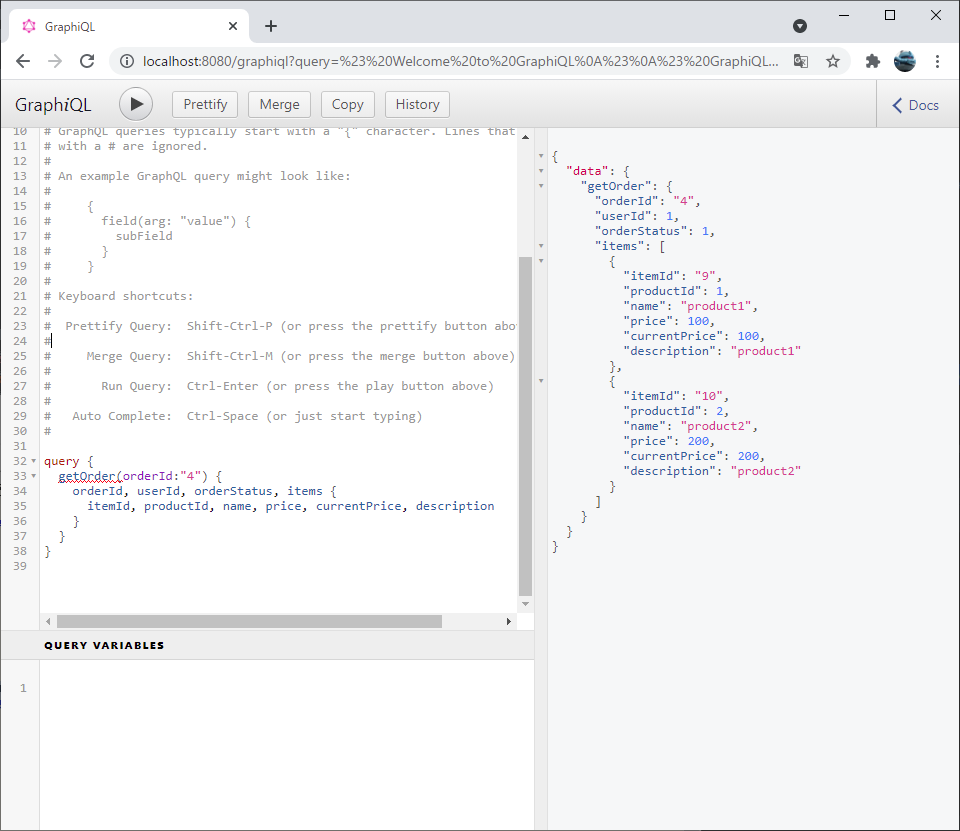

# API

## 認証
- ログイン
> curl -i --cookie-jar cookie http://localhost:8080/preflight
> TOKEN=$( cat cookie | grep 'XSRF' | cut -f7 )
> SESSION=`curl -i --cookie cookie -d "_csrf=$TOKEN" -d name=user1 -d password=user1 -L http://localhost:8080/login | grep -E "SESSION\=[^ ]+" -o`
 or
> SESSION=`curl -i --cookie cookie  -H "X-XSRF-TOKEN:$TOKEN" -d name=user1 -d password=user1 -L http://localhost:8080/login | grep -E "SESSION\=[^ ]+" -o`

- 商品検索
> curl -i -XGET --cookie cookie -b "$SESSION" -d "_csrf=$TOKEN" http://localhost:8080/product/search?limit=20&offset=0

- ショッピングカートのアイテムを更新
> curl -i -XPOST --cookie cookie -b "$SESSION" -H "X-XSRF-TOKEN:$TOKEN" -H 'Content-Type:application/json' -d '{"productId": 1, "number": 2 }' http://localhost:8080/order/updateItem

- ショッピングカート内容確認
> curl -i -XGET --cookie cookie -b "$SESSION" -H "X-XSRF-TOKEN:$TOKEN" http://localhost:8080/order/curt_info

- 購入確定
> curl -i -XPOST --cookie cookie -b "$SESSION" -H "X-XSRF-TOKEN:$TOKEN" -H 'Content-Type:application/json' -d '{"paymentType": 1 }' http://localhost:8080/order/confirm

- ログアウト
> curl -i --cookie cookie cookie -b "$SESSION" -d "_csrf=$TOKEN" http://localhost:8080/logout

- GraphQL
  
